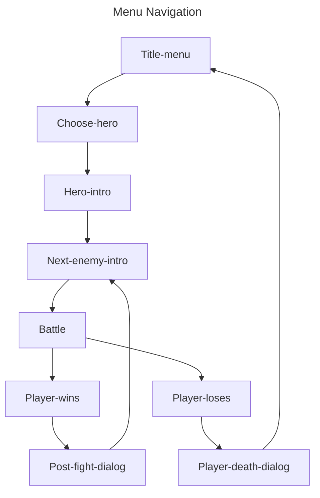
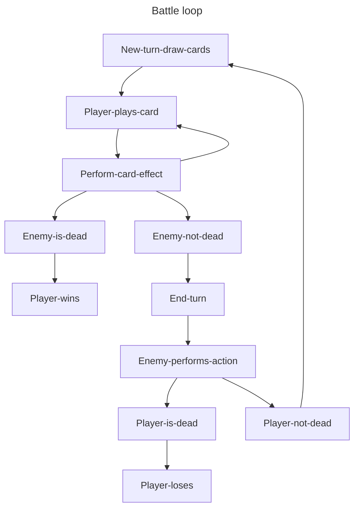

# Generative Adversaties

Basic browser-based dungeon crawler card battler game

## Project Description

Crypt of the Generative Adversaties is a turn-based card battler dungeon crawler, inspired by *Dream Quest* and *Slay the Spire*.

_Delve into the hauted crypt. Battle increasingly stronger enemies, and build a deck full of potent cards and devistating combinations. Will you uncover the shocking secret hidden at the bottom of the crypt, or will you fall to the terrifying creatures that protect it?_

## Gameplay
- Players start with a deck of cards, and a health pool, and three power crystals.
- Each round, an emeny is presented, and the player battles the enemy to the death.
- Each turn, players draw cards, and the player may play any of the available cards in their hand.
- Each turn, the enemy will signal a damage value, or protection value.
- At the end of the turn, the enemy will either attack the player for the signaled value, or add armor worth the armor amount.
- Cards either do damage, or protect the player with armor.
- Damage applies to armor first, then to health.
- If the enemy's health reaches 0, the player immediately progresses to the next round.
- If the player's health reaches 0, the player loses immediately.


## Game States






## Pseudo-code for Battles
```js

newBattle() {
   initBattle()
   newTurn()
}

initBattle() {
   buildPlayerDeck()
   loadEnemy()
}

newTurn() {
   discardHand()
   refreshManaPool()
   dealCards()
}

playCard(card) {
   performCardEffect(card)
   isEnemyDead() ? playerWins()
}

endTurn() {
   performEnemyAction(action)
   isPlayerDead() ? playerLoses()
}

performCardEffect(card) {
   card('damage') ? hurtEnemy(card.effect.value)
   card('armor') ? gainArmor(card.effect.value)
}

```


## MVP milestones

* As a player, I should to be able to start a game, play cards, end my turn in a loop until my character dies, or the enemy dies.

* As a player, I should see a win state when all enemies have been defeated, and a lose state when the player's health reaches 0 

* As a player, I should be able to see at least 10 random enemy types and at least 3 unique cards per class (9 total), utilizing the following mechanics:
     - Damage
     - Armor
     - Draw card
     - Bleed (debuff)
     - Disable

* As a player, I should be able to add a new card to my deck after defeating an enemy, creating a more powerful deck as more enemies are defeated

* As a player, I should experience coherant dialog


## Stretch Goal Milestones

* Add a final boss
  
* Balance gameplay

   | Level           | 1    | ... |  6  | ... |  Final Boss  |
   | :-------------- | :--: | :-: | :-: | :-: | :----------: |
   | Win Rate        | 99%  | ... | ~50% | ... | 10%          |

* Add 15-20 randomized enemies, add thematic action sequences
     - Damage
     - Armor
     - Bleed (debuff)
     - Enrage (buff)
     - Hide (buff)

* Add cards with the following mechanics:
   - Direct effects
        - Damage
        - Draw
        - Restore HP
        - Restore mana   
   - Buffs
        - Armor
        - Thorns
        - Strength (+damage dealt)
        - Agility (Critical hit chance)
        - Resiliance (Decrease damage taken)   
   - Debuffs
        - Enfeable (increase damage **taken**)
        - Weaken (decrease damage **dealt**)
        - Bleed (damage per turn)
        - Stun (skip turn)

* Add 8-bit background music
  
* Sound effects for player actions that correspond to different card types
   - Physical attacks
   - Magic attacks
   
* Sound effects for boss intros and attacks


## Schedule

| Friday          | Saturday    | Sunday  |  Monday          | Tuesday      |  Wednesday   | Thursday     | Friday   |
| :-------------- | :--------- | :----- | :-------------- | :---------- | :---------- | :---------- | :-------|
| Gameplay MVP    | (Relax)     | (Relax) | Rewrite Gameplay | Implement UI | Add content  | Content / UI | Scramble |


## Wire Frame (Battle scene)


