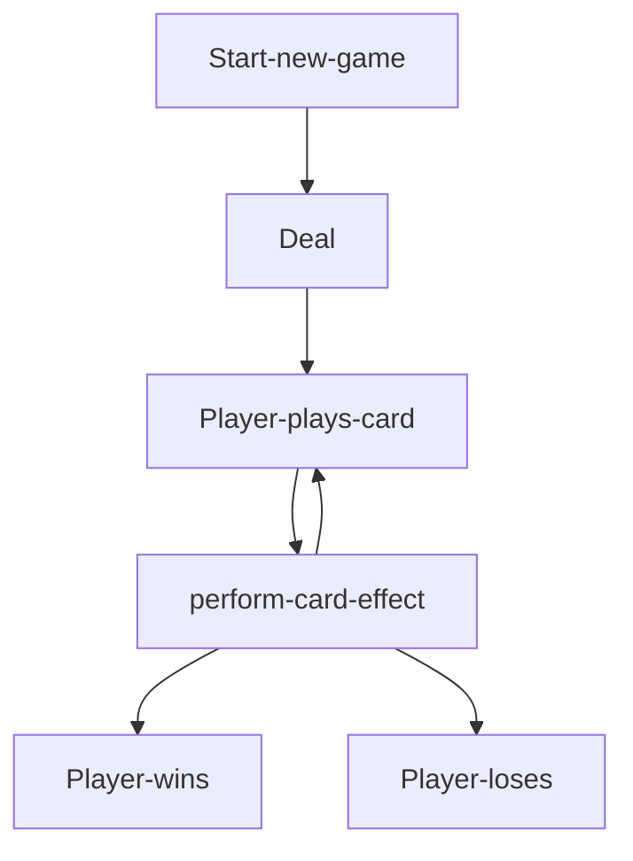

# Dungeon Battler
Basic browser-based dungeon crawler card battler game

## Gameplay
- Players start with a deck of cards, and a health pool, and three power crystals.
- Each round, an emeny is presented, and the player battles the enemy to the death.
- Each turn, players draw cards, and the player may play any of the available cards in their hand.
- Each turn, the enemy will signal a damage value, or protection value.
- At the end of the turn, the enemy will either attack the player for the signaled value, or add armor worth the armor amount.
- Cards either do damage, or protect the player with armor.
- Damage applies to armor first, then to health.
- If the enemy's health reaches 0, the player immediately progresses to the next round.
- If the player's health reaches 0, the player loses immediately.

## Game Loop

1. Player starts a New Game  
2. Player plays any number of cards
3. Player clicks "finish turn" (Enemy action resolves)
4. Repeat until either enemy or player dies
5. New round (repeat)
6. After defeating the last enemy, player wins

## Wire Frames

 (TODO: Finish wireframes)

#### MVP goals

* As a player, I want to be able to start a game, and play cards and end turn until my character dies, or the last enemy dies

* As a player, I should see a win state when all enemies have been defeated, and a lose state when the player's health reaches 0 

* As a player, I should be able to see at least 10 random enemies and at least 11 types of cards with the following mechanics:
     - Damage
     - Armor
     - Draw card
     - Restore mana

* As a player, I should be able to add a new card to my deck after defeating an enemy, creating a more powerful deck as more enemies are defeated

#### Stretch Goals

* Full game with *at least* one end-game boss
  
* Balanced gameplay:

   | Level           | 1    |  2  |  3  |  4  |  5  |  6  |  7  |  8  |  9  |  10  |
   | :-------------- | :--: | :-: | :-: | :-: | :-: | :-: | :-: | :-: | :-: | :--: |
   | Win Rate        | 100% | 90% | 80% | 70% | 60% | 50% | 40% | 30% | 20% | 10%  |

* 15-20 randomized enemies, with a variety of thematic abilities

* A variery of cards/abilities with the following mechanics
   - Direct effects
        - Damage
        - Draw
        - Restore HP
        - Restore mana   
   - Buffs
        - Armor
        - Thorns
        - Strength (+damage dealt)
        - Agility (Critical hit chance)
        - Resiliance (Decrease damage taken)   
   - Debuffs
        - Enfeable (increase damage **taken**)
        - Weaken (decrease damage **dealt**)
        - Bleed (damage per turn)
        - Stun (skip turn)

* 8-bit background music
  
* Sound effects for player actions that correspond to different card types
   - Physical attacks
   - Magic attacks
   - Defensive cards
   
* Sound effects for boss intros and attacks

### Gameplay logic (JavaScript)

   * Card effect structure: `[{ armor: 5}, {enfeable: 5}, {bleed: 5}]`

   * Enemy class structure: `{ debuff: value, buff: value, maxHP: value, remainingHP: value }`

   * Card engine will parse each effect and execute it in order of effect priorety

   * Enemy will deal damage once the player clicks "end turn"

